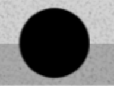
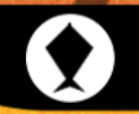

# fox-game

Tamagochi-like game.

Built as part of Brian Holt's Let's-Build-a-Game course on Frontend Masters.

Desktop-only.

## Game rules:

Make the fox live as long as possible by attending to it's needs: feed the fox when it is hungry, clean after the fox when it poops. The fox will indicate what it needs.

### Control buttons:

-  - Press the middle button to start the game and to accept your choice of action. (works as 'START', 'OK', 'ACCEPT' button);
-  - Press to move left;
-  - Press to move right;

### Switch between states:

-  - Select to feed the fox;
-  - Select to clean after the fox;
-  - Select to change the weather;

#### Run project:

```
npm run dev
```
